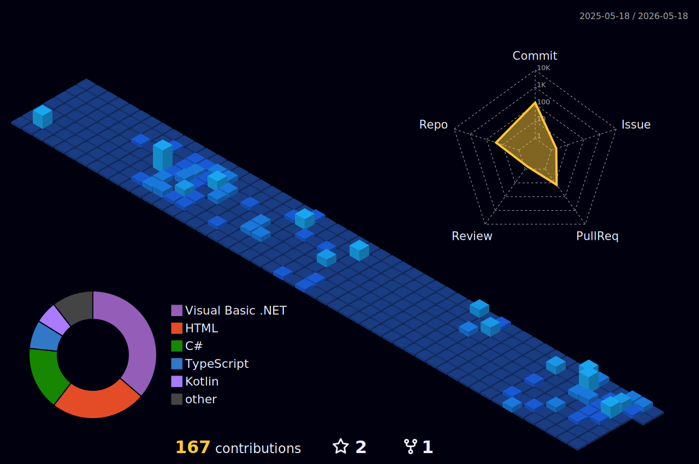

# Olá, eu sou o Kauã Marques 👋

Sou Desenvolvedor Full Stack especializado no ecossistema **.NET (C#)** e apaixonado por **Arquitetura de Sistemas** e **Inteligência Artificial**. Tenho experiência sólida em modernização de sistemas legados e na construção de APIs escaláveis para grandes players do mercado financeiro e de seguros.

---

### 🚀 Sobre Mim
- 🛠️ **Foco Atual:** Desenvolvimento de microserviços em .NET 7/8 e orquestração com Docker.
- 🏗️ **Arquitetura:** Experiência com CQRS, Mensageria e sustentação de sistemas com 20k+ usuários simultâneos.
- 🎓 **Educação:** Pós-graduando em Inteligência Artificial pela Anhembi Morumbi.
- 🐧 **Mindset:** Usuário de Linux (Arch/Ubuntu), entusiasta de automação e performance.

---

### 💻 Stack Tecnológica

#### 📂 Operational System

#### ⚙️ Languages & Frameworks

#### 🗄️ Database

#### 🛠️ Work Tools

---

### 📈 Estatísticas e Atividades

---

### 📫 Conecte-se comigo

---
